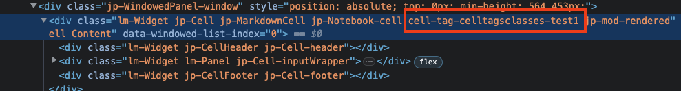

# jupyterlab_celltagsclasses

[](https://github.com/parmentelat/jupyterlab-celltagsclasses/actions/workflows/build.yml)

An extension to expose cell tags as CSS classes

## Requirements

- JupyterLab >= 4.0.0

## Install

To install the extension, execute:

```bash
pip install jupyterlab_celltagsclasses
```

## Uninstall

To remove the extension, execute:

```bash
pip uninstall jupyterlab_celltagsclasses
```

## What it does

### CSS classes

each cell has its widget (the DOM element) classes kept in sync in terms of the cell's tags;  
for example, adding tag `foobar` will result in the current cell having class `cell-tag-foobar` added

specifically the DOM elements that are decorated have the `.jpCell` class set by jlab, like so, where we have set tag `celltagsclasses-test1`



### metadata management helper functions

it also exports utilities to manage a cell's metadata, specifically for

- getting, setting or unsetting a key/value pair
- adding, removing items in a list inside the metadata (e.g. tags)
- cleaning the metadata for empty/useless items

to that effect, see the `md_get` and similar functions in `metadata.ts` (that can be imported right from the module)

### helper: apply function on cells

the `apply_on_cells` function allows you to write a function that works on an individual cell, and then call it on either

- the active cell only
- all the selected cells if relevant, otherwise the active cell
- all the cells in the notebook

for that you can pass it a `Scope` value that can be either `Active`, `Multiple`, or `All`

## Development

See the documentation on Jlab extensions for more details; the gist of it is

### Development install

```bash
# Clone the repo to your local environment
# Change directory to the jupyterlab_celltagsclasses directory
# Install package in development mode
pip install -e "."
# Link your development version of the extension with JupyterLab
jupyter labextension develop . --overwrite
# Rebuild extension Typescript source after making changes
jlpm build
```

You can watch the source directory and run JupyterLab at the same time in different terminals to watch for changes in the extension's source and automatically rebuild the extension.

```bash
# Watch the source directory in one terminal, automatically rebuilding when needed
jlpm watch
# Run JupyterLab in another terminal
jupyter lab
```

### Development uninstall

```bash
pip uninstall jupyterlab_celltagsclasses
```

In development mode, you will also need to remove the symlink created by `jupyter labextension develop`
command. To find its location, you can run `jupyter labextension list` to figure out where the `labextensions`
folder is located. Then you can remove the symlink named `jupyterlab-celltagsclasses` within that folder.

### Packaging the extension

See [RELEASE](RELEASE.md)

## testing

### the metadata module

probably suboptimal but that's my first..

```terminal
npm install -g typescript '@types/node'
```

```terminal
rm src/*js
tsc src/xpath*ts && node src/xpath-test.js
```

I have tried to use `ts-node` but to no avail so far
